# Ejercicios extra

## 1. Configuración de Git

1. [x] Configurar el nombre de usuario y el correo electrónico globalmente y por repositorio con `git config`.
       1.1 Configurar el nombre de usuario y correo electrónico globalmente:
   ```bash
   git config --global user.name "cdryampi"
   git config --global user.email "cdryampi@gmail.com"
   ```
   1.2 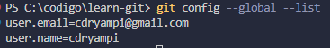
2. [x] Verificar las configuraciones actuales y cambiarlas si es necesario.
       2.1 En caso que no se haya configurado el nombre de usuario y correo electrónico, se puede verificar con el siguiente comando:
   ```bash
   git config --list
   ```
3. [x] Personalizar un alias para un comando frecuente (ej. `git log` con una vista simplificada).
       3.1 Personalizar un alias para un comando frecuente:
   ```bash
   git config --global alias.lg "log --oneline --graph --all"
   ```
   3.2 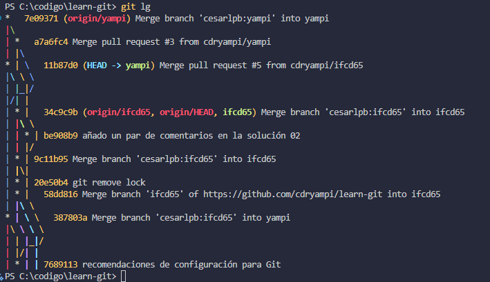

---

## 2. Inicialización y Primeros Pasos

1. [x] Inicializar un repositorio vacío con git init y verificar el contenido del directorio `.git`.
       `bash
    cd mi-primer-repositorio
    git init
    dir
`
2. [x] Añadir varios archivos al área de staging con `git add` y confirmar los cambios con `git commit`.
       `bash
    touch "Hola Mundo" > readme.md
    git add hola.txt # Añadir archivo al área de staging
    git commit -m "Añadir archivo hola.txt" # Confirmar cambios
`

3. [x] Crear un historial inicial con al menos tres commits y visualizarlo con `git log`.

   3.1 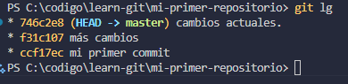

---

## 3. Ramas y Etiquetas

1. [x] Modificar un archivo, añadirlo al área de staging, y deshacer los cambios antes del commit con `git reset`.
       1.1 Modificar un archivo y añadirlo al área de staging:

   ```bash
   echo "Hola Mundo" > hola.txt
   git add hola.txt # Añadir archivo al área de staging
   ```

   1.2 Deshacer los cambios antes del commit con `git reset`:

   ```bash
       git reset --hard # Deshacer los cambios
   ```

   1.3 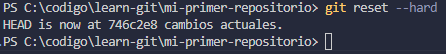

2. [x] Usar `git rm` para eliminar un archivo del repositorio y registrar el cambio.
       2.1 [x] Crear un archivo y añadirlo al área de staging:

   ```bash
   echo "Hola Mundo" > hola.txt
   git add hola.txt # Añadir archivo al área de staging
   ```

   2.2 [x] Eliminar un archivo del repositorio y registrar el cambio:

   ```bash
   git rm --cached hola.txt # Eliminar archivo del repositorio
   rm hola.txt # Eliminar archivo del sistema de archivos local porque no tenemos .gitignore
   git commit --allow-empty -m "Eliminando el fichero de hola.txt" # Registrar el cambio al tener vacío el área de staging y no tener archivos para registrar tenemos que hacer un `allow-empty`
   ```

3. [x] Ignorar archivos o carpetas específicas creando un archivo .gitignore y validarlo con `git status`.

   3.1 [x] Crear un archivo .gitignore y añadir archivos o carpetas específicas:

   ```bash
   echo "hola.txt" > .gitignore
   ```

   3.2 [x] Validar el archivo .gitignore con `git status`:
   [!resultado](./resultados/opcional_3_3.png)
   3.3 Podemos ver que el archivo hola.txt no aparece en el área de staging porque está en el archivo .gitignore.

---

## 4. Repositorios Remotos

1. [x] Revisar el historial de cambios con `git log` utilizando diferentes opciones para filtrar resultados (por ejemplo, `--oneline` o `--author`).
       1.1 Podemos ver el historial de cambios con `git log` utilizando diferentes opciones para filtrar resultados:
   ```bash
       git log # Muestra los commits de la rama actual de forma detallada
   ```
   1.2 Podemos ver el historial de cambios con `git log --online` utilizando diferentes opciones para filtrar resultados:
   ```bash
       git log --oneline # Muestra los commits de la rama actual de forma resumida, retrocedemos al git padre para poder apreciar mejor el resultado
   ```
   1.3 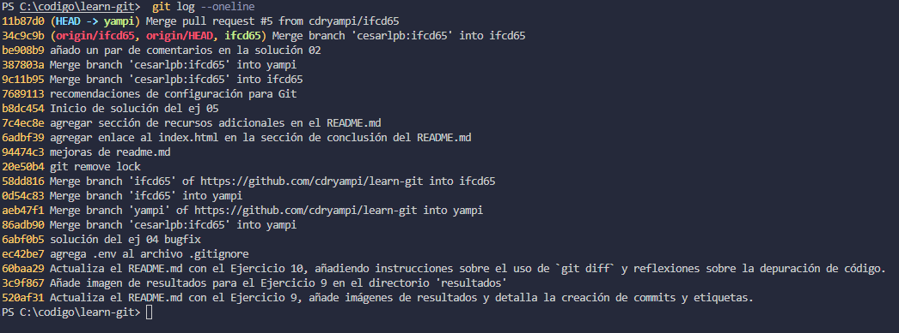
   1.4 Podemos ver el historial de cambios con `git log --author` utilizando diferentes opciones para filtrar resultados:
   ```bash
       git log --author="cdryampi" # Muestra los commits de la rama actual realizados por un autor específico
   ```
2. [x] Ver las diferencias entre el último commit y el área de trabajo actual con `git diff`.
       2.1 Podemos ver las diferencias entre el último commit y el área de trabajo actual con `git diff`:

   ```bash
       git diff # Muestra las diferencias entre el último commit y el área de trabajo actual
   ```

   2.2 Podemos comparar los cambios de los ficheros de un ``commit` con otro. Por ejemplo los cambios de un commit con otro.

   ```bash
       git diff <commit> <commit> # Muestra las diferencias entre dos commits
   ```

   2.3 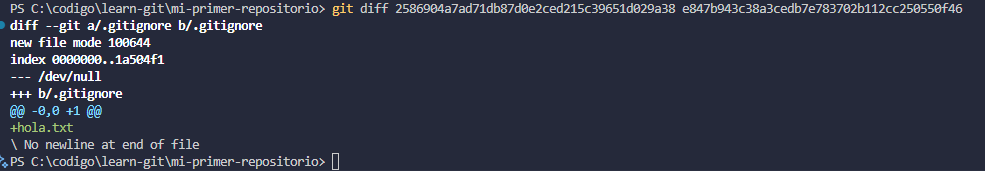

3. [x] Usar `git blame` para identificar qué cambios se hicieron en una línea específica de un archivo.
       3.1 Podemos usar `git blame` para identificar qué cambios se hicieron en una línea específica de un archivo:
       3.1.1 Podemos cambiar de rama a la `ifcd65` para poder apreciar mejor el resultado
   ```bash
       git checkout ifcd65 # Cambiar de rama
       git blame readme.md # Muestra los cambios realizados en cada línea de un archivo
   ```
   3.2 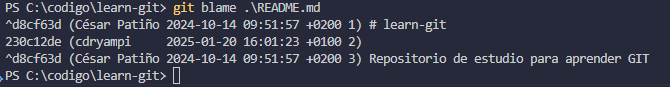

---

## 5. Trabajo con Ramas

1. Crear y cambiar entre ramas con `git branch` y `git checkout`.
   1.1 Crear una rama secundaria con `git branch`:
   ```bash
       git branch nueva_rama yampi # Crear una rama secundaria a partir de la rama actual `yampi`
   ```
2. Fusionar una rama secundaria a la rama principal con `git merge`.
   2.1 Fusionar las ramas secundarias a la rama principal con `git merge`:
   2.1.1 Al cambiar de rama a la rama `nueva_rama` podemos funcionarla con la rama `yampi` y podemos hacer un `merge` para fusionar las ramas para poder añadir los ficheros de Ejercicios_extra.md y las imágenes de resultados.

   ```bash
        git checkout nueva_rama # Cambiar de rama
   ```

   2.1.2 Tenemos que subir la nueva rama hacia el github

   ```bash
         git push origin nueva_rama # Subir la rama secundaria al repositorio remoto
   ```

   2.1.3 Al hacer eso tenemos que hacernos una petición de `pull request` para poder fusionar las ramas. **importante: no fusionar las ramas con la rama nodriza**
   2.1.4 Seleccionamos a `yampi` como base del mismo proyecto, luego como compare seleccionamos a `nueva_rama` y creamos la petición de `pull request`.
   2.1.5 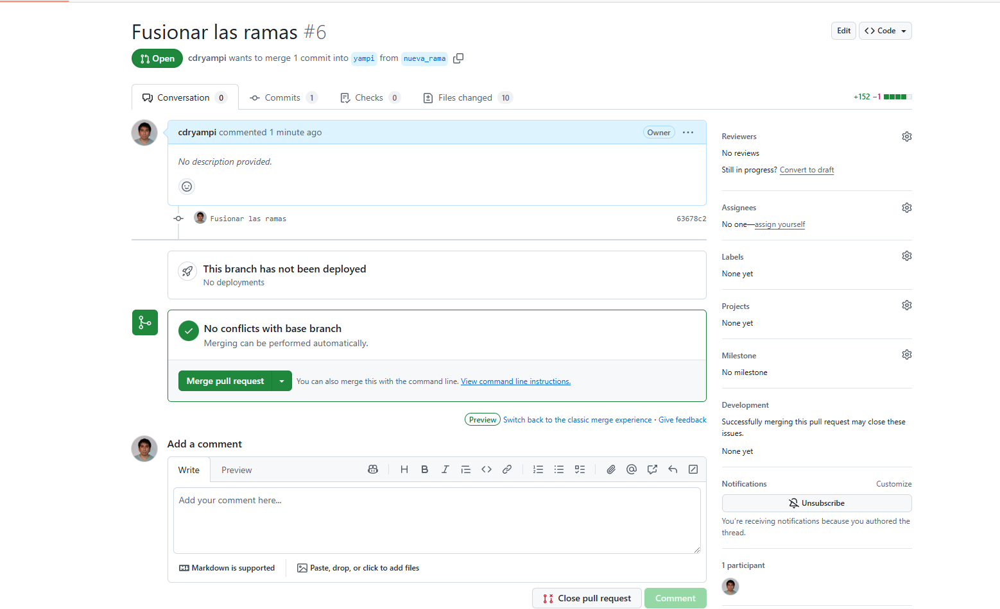

3. Resolver un conflicto generado al intentar fusionar dos ramas que contienen cambios en la misma línea de un archivo.
   3.1 Al no tener guardado el fichero de Ejercicios_extra.md en la rama `yampi` y tenerlo en la rama `nueva_rama` podemos hacer un `merge` para fusionar las ramas para poder añadir los ficheros de Ejercicios_extra.md y las imágenes de resultados.
   ```bash
       git checkout yampi # Cambiar de rama
       git pull origin yampi # Actualizar la rama principal
   ```
   3.2 Podemos ver el historial de la rama con el GitLens
   3.3 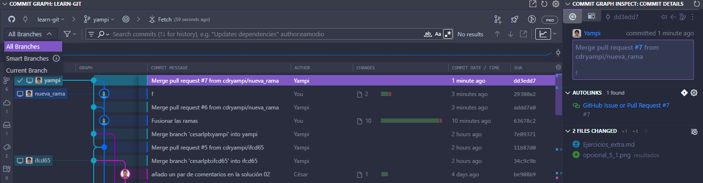

## 6. Correcciones y Ajustes

1. [x] Modificar el mensaje del último commit usando `git commit --amend`.
       1.1 Añadir un comentario a un nuevo commit:
   ```bash
       git add Ejercicios_extra.md
       git commit -m "asdasdas"
   ```
   1.2 Supongamos que nos equivocamos en el comentario del commit, podemos modificar el comentario del commit con `git commit --amend`:
   ```bash
       git commit --amend -m "Nuevo comentario"
   ```
   1.3 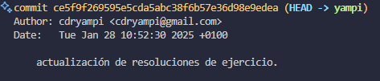
2. [x] Restaurar un archivo al estado de un commit anterior con `git checkout`.
       2.1 Añadimos un nuevo commit para poder restaurar el archivo al estado de un commit anterior:
   ```bash
        git add Ejercicios_extra.md
        git commit -m "Nuevo commit"
   ```
   2.2 Podemos restaurar un archivo al estado de un commit anterior con `git checkout`:
   ```bash
        git checkout HEAD~1 Ejercicios_extra.md
   ```
3. [x] Crear un commit que revierta los cambios realizados en un commit específico con `git revert`.
       3.1 Añadimos un nuevo commit para poder revertir los cambios realizados en un commit específico:
   ```bash
         git add Ejercicios_extra.md
         git commit -m "Nuevo commit"
         git log --oneline # Muestra los commits de la rama actual de forma resumida
         git revert HEAD~1 # Revertir los cambios realizados en un commit específico
         git log --oneline # Muestra los commits de la rama actual de forma resumida
   ```
   3.2 Podemos revertir los cambios realizados en un commit específico con `git revert`:
   ```bash
         git log --oneline # Muestra los commits de la rama actual de forma resumida
         git revert HEAD~1 # Revertir los cambios realizados en un commit específico
   ```
   3.3 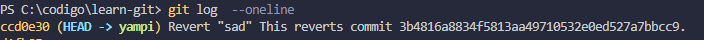
   precambios
