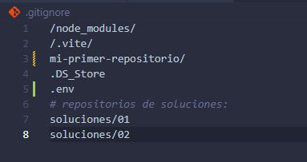
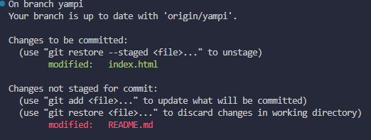
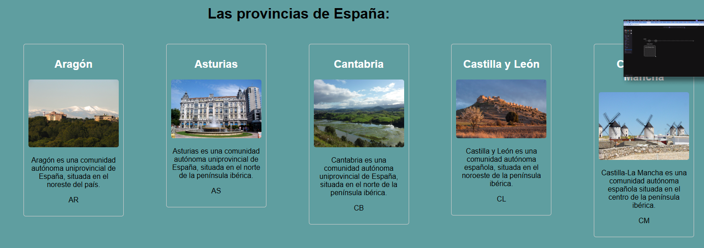
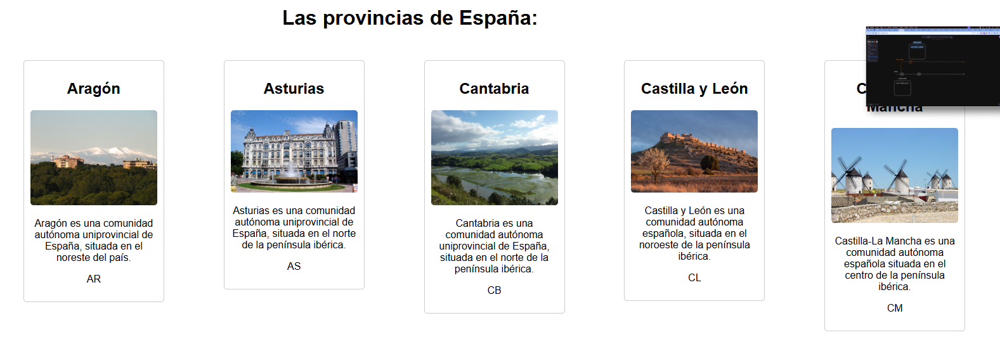
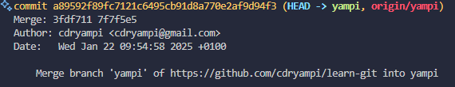
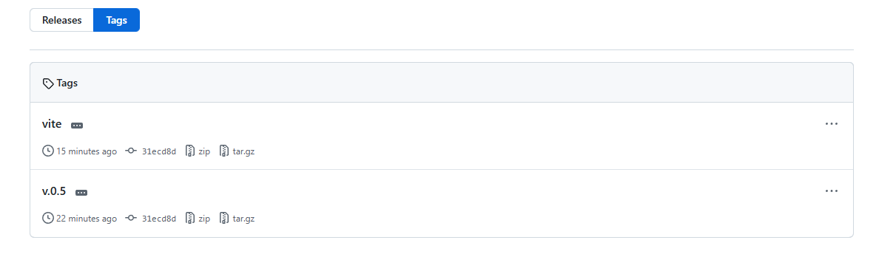
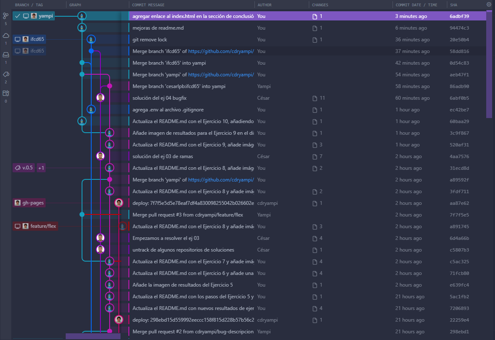

# Learn Git

Repositorio de estudio para aprender **Git**.

---

## ✅ **Ejercicio 0**

1. ✅ **Crear un repositorio local** llamado `mi-primer-repositorio` (**importante:** no se usan caracteres especiales ni espacios).
2. ✅ **Añadir al `.gitignore`** el archivo `mi-primer-repositorio` (**importante:** no es necesario que se suba al repositorio remoto).
3. ✅ **Inicializar Git** en la carpeta `mi-primer-repositorio` con:
   ```bash
   git init
   ```
4. ✅ Comprobar que se ha creado una carpeta con una subcarpeta `.git`.
5. ✅ Hacer un commit inicial con el mensaje: `Mi primer commit`:
   - Crear un archivo `README.md` con el nombre del repositorio.
     
6. ✅ Revisar el log de Git con `git log` o usando el control de cambios de **añadiendo más cambios a Readme.md**.
   

---

## 🛠️ **Ejercicio 1**

1. ✅ **Crear un archivo `index.html` básico**:
   - Contiene un pequeño texto, descripción e imagen de una API externa **Se ha probado payload cmd con pocos éxitos para trabajarlo fullrest**.
   - La aplicación utiliza un servidor de Vite, que se inicia con:
     ```bash
     npm run dev
     ```
     
     
2. ✅ **Añadir el archivo al staging** con:
   ```bash
   git add index.html
   ```
3. ✅ **Hacer un commit** con el mensaje:
   ```bash
   git commit -m "Añade archivo index.html"
   ```
4. ✅ **Subir los cambios al repositorio remoto** con:
   ````bash
       git push
       ```
   ````
5. ✅ **Verificar que los cambios se han subido correctamente**.
   - Se ha subido correctamente el archivo `index.html` al repositorio remoto y no hay conflictos.

---

## 🔁 **Ejercicio 2**

1. ✅ Clonar el repositorio `learn-git`.
   - **Importante:** Se realiza un fork del repositorio original.
2. ✅ Hacer un `git pull` para actualizar el contenido.
3. ✅ Cambiar a la rama `main` y actualizarla:
   ```bash
   git checkout main
   git pull
   ```
   
4. 🛠️ Se tendrá que Resolver periodicante los conflictos de .gitignore de proyecto princial con el local.

---

## 🌿 **Ejercicio 3**

1. ✅ Crear un archivo cualquiera y hacer un commit.
   
2. ✅ Crear una nueva rama llamada `index_espanya` **Hacemos en index.html más inclusivo**.
   
3. ✅ Cambiar a la rama `yampi` y ver los cambios anteriores **Esta versión es menos inclusiva**.
   
4. ✅ Comprobar que los historiales de ambas ramas difieren:
   ```bash
   git log
   git checkout
   ```
   - Logs de la rama `yampi`:
     
   - Logs de la rama `index_espanya`:
     

---

## 🐛 **Ejercicio 4**

1. ✅ Crear una rama nueva llamada `bug-descripcion` para solucionar un error en el archivo `index.html` (etiqueta mal cerrada).
   
2. ✅ Corregir el error y hacer un commit con el mensaje:
   ```
   Corrige el bug relacionado con la descripción
   ```
   
3. ✅ Cambiar a la rama `yampi` y fusionar los cambios desde `bug-descripcion`:
   ```bash
   git checkout yampi
   git merge bug-descripcion
   ```
   
4. 🛠️ Se ha subido los cambios a Github para hacer un PR para poder resolver conflictos de la rama `yampi` y `bug-descripcion`.

---

## ⚙️ **Ejercicio 5**

1. ✅ Revisar la configuración actual con:
   ```bash
   git config --list
   ```
2. ✅ Cambiar el nombre y el correo global con:
   ```bash
   git config --global user.name "Tu Nombre"
   git config --global user.email "tu@email.com"
   ```
3. ✅ Crear un nuevo repositorio y verificar que los commits llevan la configuración actualizada.
   

---

## 📝 **Ejercicio 6**

1. ✅ Crear un archivo `.gitignore` y añadir reglas para ignorar:
   - Por ejemplo: `*.log`, `node_modules/`, etc.
2. ✅ Comprobar que los archivos ignorados no se añaden al staging con:
   ```bash
   git status
   ```
   
3. 🛠️ La rama yampi es esta basada en la rama del fork principal por lo tanto se tiene que mergear cada vez que su rama padre haga un pull de la rama nodriza.

---

## 🔄 **Ejercicio 7**

1. ✅ Modificar un archivo existente sin añadirlo al staging.
   
2. ✅ Deshacer los cambios con:
   ```bash
   git checkout -- <archivo>
   ```
3. ✅ Hacer un cambio, añadirlo al staging y luego deshacerlo con:
   ```bash
   git reset HEAD <archivo>
   ```
   
   

---

## 🔀 **Ejercicio 8**

1. 🌱 **Crea dos ramas:** `yampi` y `feature/flex`.

   - ¡Listas para trabajar! 🛠️

2. ✏️ **Modifica una línea en la rama `yampi` y haz un commit:**

   - Cambia los estilos de las cajas de `grid` a `flex` en el archivo `index.html` (rama `feature/flex`).
   - Se modificó el fichero `README.md` en ambas ramas para **forzar un conflicto** en el siguiente paso.

3. 🔧 **Cambia a la rama `feature/flex` y modifica la misma línea:**

   - Resuelve los ejercicios y prepara la rama para el merge.

4. 🚨 **Intenta combinar las ramas `feature/flex` y `yampi`:**

   - Realiza un merge desde `feature/flex` a `yampi` y resuelve los conflictos.
   - Utiliza `git merge feature/flex` en la rama `yampi`.

5. 🎉 **Resultados:**
   - Se resolvió el conflicto en `yampi` y se realizó el merge correctamente.
     
   - **Nota importante:** Durante el proceso, hubo un problema con imágenes duplicadas (mismo nombre). Esto resultó en un error de visualización inicial que fue corregido posteriormente. ✅

---

## 🏷️ **Ejercicio 9**

1. ✅ Crear una etiqueta ligera (lightweight tag):
   ```bash
   git tag v0.5
   ```
2. ✅ Crear una etiqueta anotada:
   ```bash
   git tag -a vite -m "Rama con servidor de Vite para los ejemplos"
   ```
3. ✅ Subir las etiquetas al repositorio remoto:
   ```bash
   git push origin --tags
   ```
   

---

## 🚀 **Ejercicio 10**

1. ✅ Realizar dos commits con cambios en un mismo archivo.
2. ✅ Comparar los cambios entre commits con:
   ```bash
   git diff <commit1> <commit2>
   ```
3. ✅ Observar las diferencias y reflexionar sobre el uso de `git diff` para depuración y resolución de conflictos.

## Observaciones 🚀

### ✅ Comparación entre commits (`git diff`)

Al realizar un `git diff` entre dos commits en la rama _yampi_, se puede revisar con claridad los cambios implementados. En este caso, la transición de una API basada en _payload cmd_ a una API desarrollada con _Django REST Framework_ permite identificar las modificaciones realizadas y entender su impacto en el código.

---

### ✅ Revisión de versiones anteriores

Aunque se pueden revisar los cambios respecto a versiones previas, esta tarea resulta mucho más intuitiva al realizar un **merge**, donde se presentan las diferencias de una forma más visual y estructurada.

---

### ⚠️ Conflictos de merge

Cuando se producen conflictos al realizar un merge, la herramienta de control de versiones destaca de manera precisa las diferencias entre los archivos afectados. Esto facilita la detección de las líneas en conflicto y el proceso de resolución.

---

### 🛠️ Resolución de conflictos

Durante el proceso de merge, Git simplifica la resolución de conflictos al proporcionar una vista detallada de las discrepancias, ayudando a integrar los cambios con mayor fluidez y eficacia.

---

### 📄 Cambios en archivos individuales

Para modificaciones específicas en un único archivo, el proceso de revisión es mucho más ágil, ya que el enfoque se centra en un solo punto de interés, permitiendo identificar los ajustes con rapidez.

---

### ✏️ Uso de editores de texto

El uso de un editor de texto avanzado (como VS Code, Sublime Text, o cualquier IDE moderno) mejora significativamente la experiencia de revisión. Estos editores permiten visualizar los cambios de forma intuitiva, con indicadores visuales, colores y funcionalidades que optimizan la navegación y comprensión del código.

💡 **Estas herramientas y estrategias no solo mejoran la gestión del código, sino que también hacen que el desarrollo sea más eficiente y colaborativo.** 🚀

---

### 🌟 **Conclusión**

Este repositorio cubre un amplio rango de conceptos básicos y avanzados de Git, incluyendo inicialización, creación de ramas, resolución de conflictos, uso de etiquetas, y manejo de `.gitignore`. Es un recurso útil para cualquier persona que desee aprender Git de manera estructurada y práctica.

---

### 🚀 **Recursos adicionales**

🚀 Enlace del index.html que se ha utilizado en los ejemplos: [index.html](https://cdryampi.github.io/learn-git/)

Plugins de Git utilizados en el proyecto:

- [Git Graph](https://marketplace.visualstudio.com/items?itemName=mhutchie.git-graph)
- [GitLens](https://marketplace.visualstudio.com/items?itemName=eamodio.gitlens)

Imagen de git-graph:

Resumen de la documentación de la API utilizada:

```json
// Ejemplo de respuesta de la API
// GET: [endpoint](https://web-production-957d3.up.railway.app/api/comunidades_autonomas/lista_comunidades/)
{
  "id": 0,
  "nombre": "string",
  "descripcion": "string",
  "codigo": "st",
  "imagen": {
    "file": "http://example.com",
    "title": "string",
    "uploaded_at": "2019-08-24T14:15:22Z",
    "image_for_pc_url": "string", // falta resolver un bug en esta parte
    "image_for_tablet_url": "string", // falta resolver un bug en esta parte
    "image_for_mobile_url": "string" // falta resolver un bug en esta parte
  }
}
```
