# learn-git

Repositorio de estudio para aprender GIT

## Ejericio 0

1. [x] Crear un repositorio local llamado `mi-primer-repositorio` (**importante:** no se usan caracteres especiales ni espacios)
2. [x] Añadir en el .gitignore el archivo `mi-primer-repositorio`(**importante:** no es necesario que se suba al repositorio remoto)
3. [x] Iniciar git en la carpeta `mi-primer-repositorio` con `git init`
4. [x] Comprobar que se ha creado una carpeta con una subcarpeta `.git`
5. [x] Hacer un cambio el mensaje: "Mi primer commit" con un `README.md` donde colocamos el nombre del repositorio
       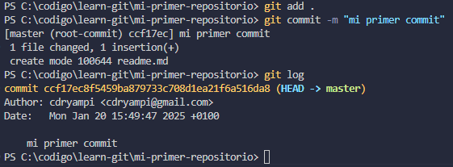
6. [x] Revisar el log de git con `git log` o usando el control de cambios de VS Code
       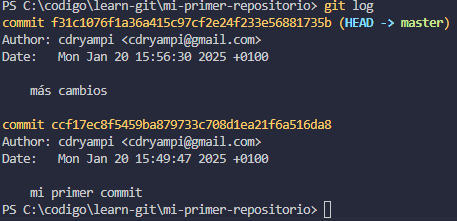

## Ejercicio 1

1. [x] Crear un repositorio local o usar uno existente. (En este caso usamos el repositorio mismo)
2. [x] Añadimos un index.html básico. Este contiene un pequeño texto, descripción y imagen de una API propia y reenderiza una provincia de España pero necesita un servidor de Vite para realizar la petición al servidor externo. iniciar la aplicación con `npm run dev`
       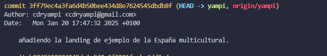
       

## Ejercicio 2

1. [x] Clonar el repositorio `learn-git`. (**importante:** se ha realizado un fork del repositorio original y se esta trabajando en una rama derivada del mismo fork).
2. [x] Hacer `git pull` para actualizar el contenido.
3. [x] Cambiamos de rama a `main` con `git checkout main` y hacemos `git pull` para actualizar la rama.
       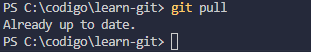

## Ejercicio 3

1. [x] Creamos un archivo cualquiera y hacemos un commit
       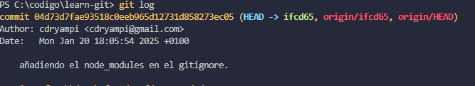
2. [x] Creamos otra rama, por ejemplo `index_espanya`
       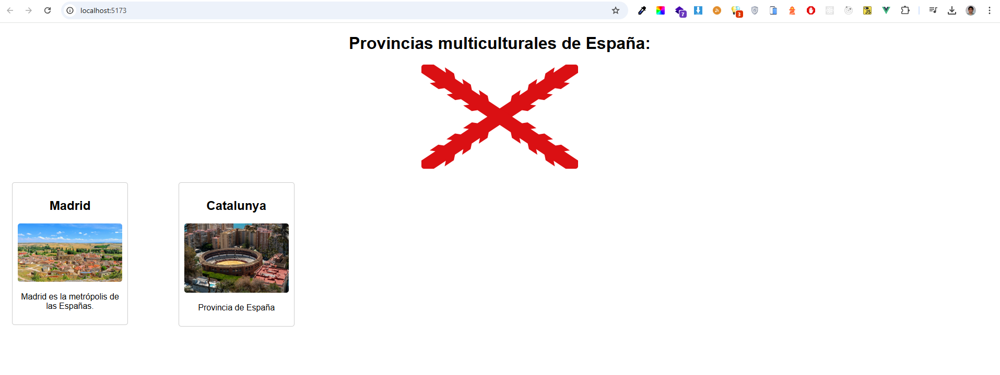
3. [x] Volvemos a la rama `yampi` y vemos los cambios anteriores
       
4. [x] Comprobamos que los historiales difieren con `git log` y `git checkout`
       4.1 [x] Comprobamos los logs de la rama `yampi`
       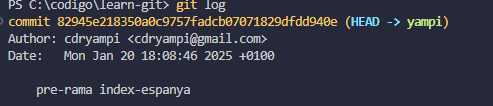
       4.2 [x] Comprobamos los logs de la rama `index_espanya`
       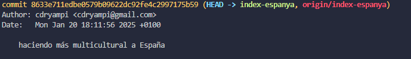
5. [x] Hemos comprobado que las dos ramas son distintas pero hay que tener en cuenta que la rama `index_espanya` se ha creado a partir de la rama `yampi` y por lo tanto tiene los mismos cambios que la rama `yampi` hasta el momento de la creación de la rama `index_espanya`.

## Ejercicio 4

1. [x] Crear una rama nueva para solucionar un bug de un archivo `index.html` con una etiqueta malcerrada.
       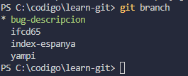
2. [x] Corregir el error y hacer un commit con el mensaje "Corrige el bug relacionado con la descripcion"
       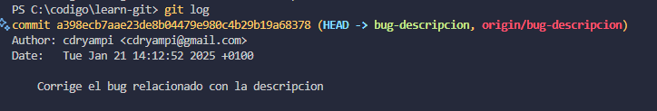
3. [x] Cambiar de nuevo a la rama `yampi` y combinar los cambios desde `bug-descripcion` con `git merge`.
       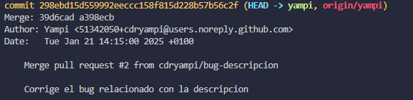
4. [x] Resultado de los cambios realizados
       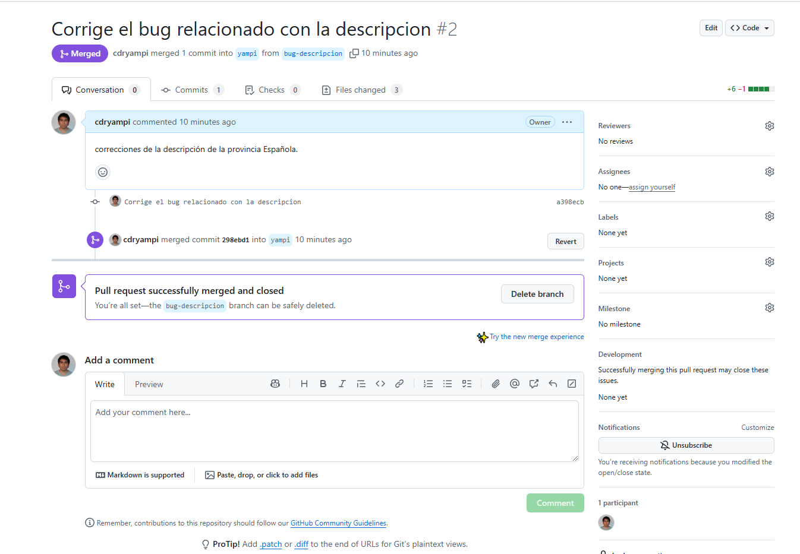

## Ejercicio 5

1. [x] Revisar la configuración actual con `git config --list`.
2. [x] Cambiar el nombre y el correo global usando `git config --global`.
3. [x] Crear un repositorio nuevo y comprueba que el commit lleva la configuración actualizada.
4. [x] Si es necesario, cambia temporalmente la configuración local solo para ese repositorio.
5. [x] Haz un commit con la configuración modificada y verifica los detalles con `git log`.
       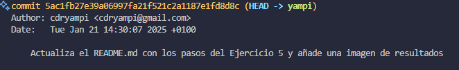
