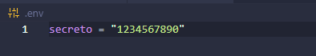
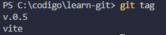

# learn-git

Repositorio de estudio para aprender GIT

## Ejericio 0

1. [x] Crear un repositorio local llamado `mi-primer-repositorio` (**importante:** no se usan caracteres especiales ni espacios)
2. [x] Añadir en el .gitignore el archivo `mi-primer-repositorio`(**importante:** no es necesario que se suba al repositorio remoto)
3. [x] Iniciar git en la carpeta `mi-primer-repositorio` con `git init`
4. [x] Comprobar que se ha creado una carpeta con una subcarpeta `.git`
5. [x] Hacer un cambio el mensaje: "Mi primer commit" con un `README.md` donde colocamos el nombre del repositorio
       
6. [x] Revisar el log de git con `git log` o usando el control de cambios de VS Code
       

## Ejercicio 1

1. [x] Crear un repositorio local o usar uno existente. (En este caso usamos el repositorio mismo)
2. [x] Añadimos un index.html básico. Este contiene un pequeño texto, descripción y imagen de una API propia y reenderiza una provincia de España pero necesita un servidor de Vite para realizar la petición al servidor externo. iniciar la aplicación con `npm run dev`
       
       

## Ejercicio 2

1. [x] Clonar el repositorio `learn-git`. (**importante:** se ha realizado un fork del repositorio original y se esta trabajando en una rama derivada del mismo fork).
2. [x] Hacer `git pull` para actualizar el contenido.
3. [x] Cambiamos de rama a `main` con `git checkout main` y hacemos `git pull` para actualizar la rama.
       

## Ejercicio 3

1. [x] Creamos un archivo cualquiera y hacemos un commit
       
2. [x] Creamos otra rama, por ejemplo `index_espanya`
       
3. [x] Volvemos a la rama `yampi` y vemos los cambios anteriores
       
4. [x] Comprobamos que los historiales difieren con `git log` y `git checkout`
       4.1 [x] Comprobamos los logs de la rama `yampi`
       
       4.2 [x] Comprobamos los logs de la rama `index_espanya`
       
5. [x] Hemos comprobado que las dos ramas son distintas pero hay que tener en cuenta que la rama `index_espanya` se ha creado a partir de la rama `yampi` y por lo tanto tiene los mismos cambios que la rama `yampi` hasta el momento de la creación de la rama `index_espanya`.

## Ejercicio 4

1. [x] Crear una rama nueva para solucionar un bug de un archivo `index.html` con una etiqueta malcerrada.
       
2. [x] Corregir el error y hacer un commit con el mensaje "Corrige el bug relacionado con la descripcion"
       
3. [x] Cambiar de nuevo a la rama `yampi` y combinar los cambios desde `bug-descripcion` con `git merge`.
       
4. [x] Resultado de los cambios realizados
       

## Ejercicio 5

1. [x] Revisar la configuración actual con `git config --list`.
2. [x] Cambiar el nombre y el correo global usando `git config --global`.
3. [x] Crear un repositorio nuevo y comprueba que el commit lleva la configuración actualizada.
4. [x] Si es necesario, cambia temporalmente la configuración local solo para ese repositorio.
5. [x] Haz un commit con la configuración modificada y verifica los detalles con `git log`.
       

## Ejercicio 6

1. [x] Crea un archivo `.gitignore` en tu repositorio.
2. [x] Añade una regla para ignorar un archivo o carpeta (por ejemplo, `*.log` o `node_modules/`).
3. [x] Intenta añadir un archivo que coincida con las reglas de `.gitignore` y verifica que no se añade al staging.
       3.1 [x] Añadimos el fichero .env al repositorio con una variable secreta.
       

4. [x] Comprueba el contenido de `.gitignore` con el comando `git status`.
       

## Ejercicio 7

1. [x] Modifica un archivo existente sin añadirlo al staging.
       
       
2. [x] Usa `git checkout -- <archivo>` para deshacer los cambios.
3. [x] Haz un cambio, añádelo al staging con `git add`, y deshaz el staging con `git reset HEAD <archivo>`.
4. [x] Verifica que el archivo vuelve al estado anterior.
       

## Ejercicio 8

1. [x] Crea dos ramas: `yampi` y `feature/flex`.
2. [x] En la rama `yampi`, modifica una línea de un archivo existente y haz un commit.
       2.0.1 [x] Se ha cambiado los estilos de las cajas de `grid` a `flex` en el archivo `index.html` en la rama `feature/flex`.
       2.1 [x] Se ha modificado el fichero de README.md en la rama `yampi` y en la rama `feature/flex` a posta para generar un conflicto en el siguiente paso.
3. [x] Cambia a `feature/flex`, modifica la misma línea de forma diferente y haz otro commit.
       3.1 [x] Se ha modificado el README.md en la rama `feature/flex` resolviendo los ejercicios y prepararemos la rama para el merge.
4. [x] Intenta combinar las ramas con git merge `feature/flex` en `yampi` y resuelve el conflicto.
       
       
       4.1 [x] Se ha resuelto el conflicto en la rama `yampi` y se ha realizado un merge con la rama `feature/flex`.
       
       4.2 **Importante:** Hay que tener en cuenta que se ha realizado un merge de la rama `feature/flex` en la rama `yampi` y se ha resuelto el conflicto generado por el nombre una imagen. Por error subí dos imagenes con el mismo nombre y no se ha podido visualizar el resultado incial.

## Ejercicio 9

1. [x] Crea un nuevo commit en tu repositorio.
       1.1 [x] Se ha creado un nuevo commit en la rama `yampi` con el mensaje "Crea un nuevo commit en la rama yampi".
2. [x] Crea una etiqueta ligera (lightweight) para el commit con `git tag v.0.5`.
3. [x] Crea una etiqueta anotada (annotated) para otro commit con `git tag -a vite -m "Rama con servidor de Vite para los ejemplos"`.
4. [x] Lista las etiquetas existentes con `git tag`.
       
5. [x] Sube las etiquetas al repositorio remoto con `git push origin --tags`.
       
