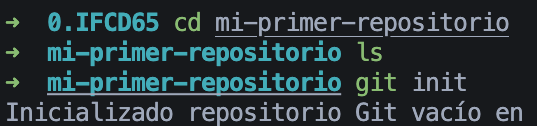
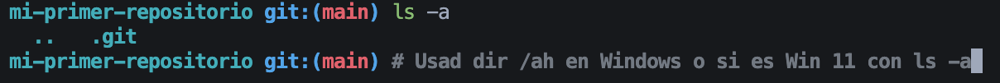
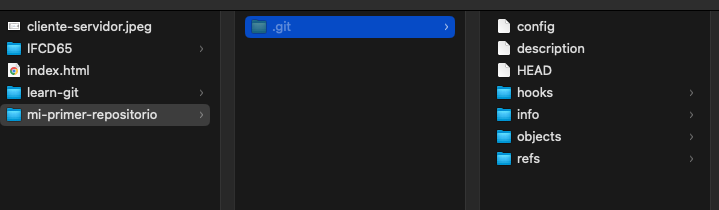
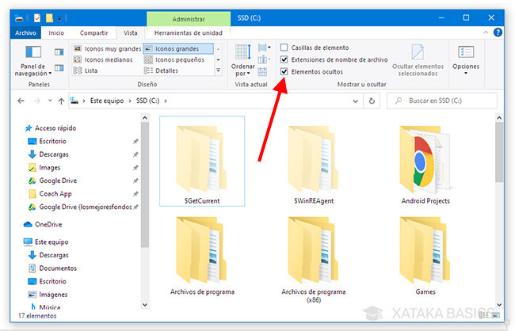
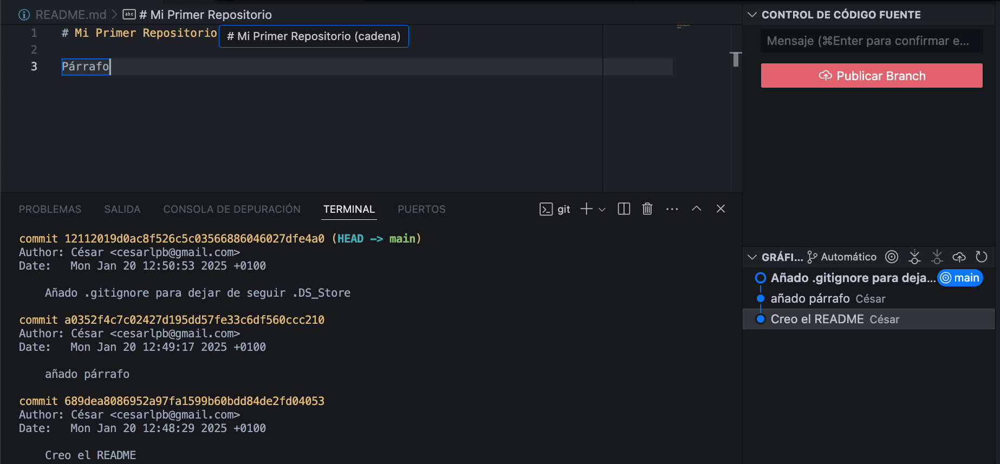

<!-- Chuleta de Markdown: https://www.markdownguide.org/cheat-sheet/ -->

- Crear un repositorio local llamado `mi-primer-repositorio` (**importante:** no se usan caracteres especiales ni espacios)

  - No colocamos un repositorio dentro de otro
  - Colocamos el repositorio nuevo en una ubicación que podamos recordar fácilmente, como Escritorio, Documentos, etc... o en `C://Code...`, o `C://IFCD65...`, o similar.
  - Vamos a usar `git init`

- Comprobamos que se ha creado una carpeta con una subcarpeta `.git`

En explorador de archivos:

Linux: `ls -a`
Mac: `Command (⌘) + Shift (⇧) + .` o `ls -a`
Windows: 

  - Actualmente, están habilitando comando de Linux en Windows, ya funciona `ls -a` en **Git Bash**
  - Más info en: https://www.computerhope.com/issues/ch001039.htm

- Vamos a hacer un cambio el mensaje: "Mi primer commit" con un `README.md` donde colocamos el nombre del repositorio

- Vamos a revisar el log de git con `git log` o usando el control de cambios de VS Code:

- Hacemos otro cambio y revisamos que aparece en el historial.

