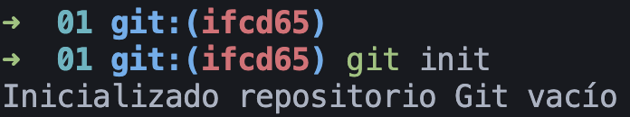
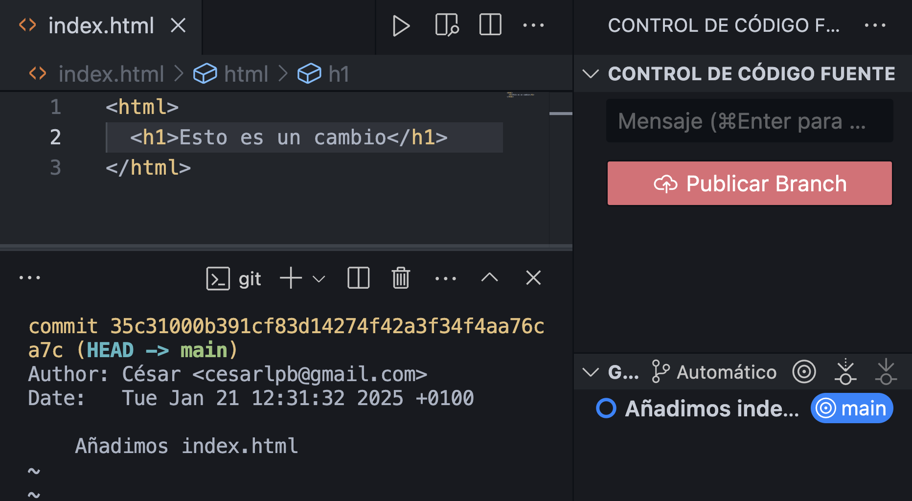
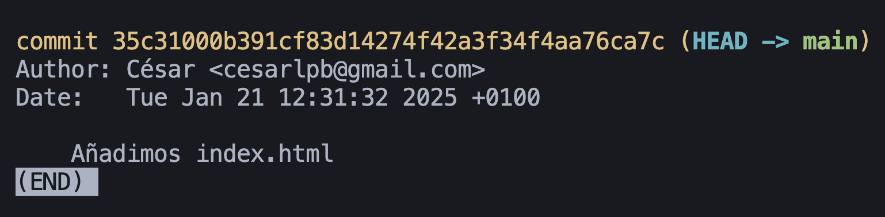
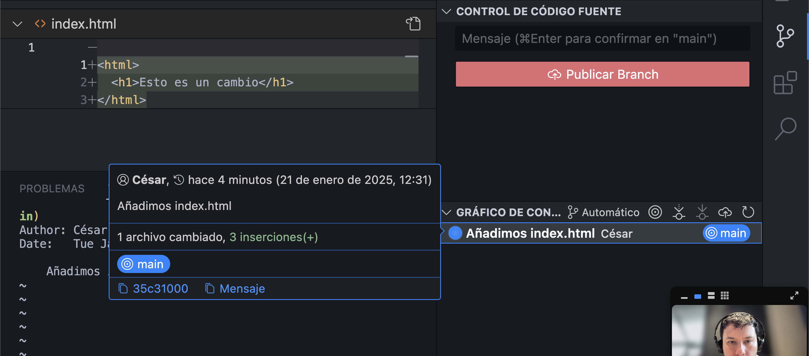
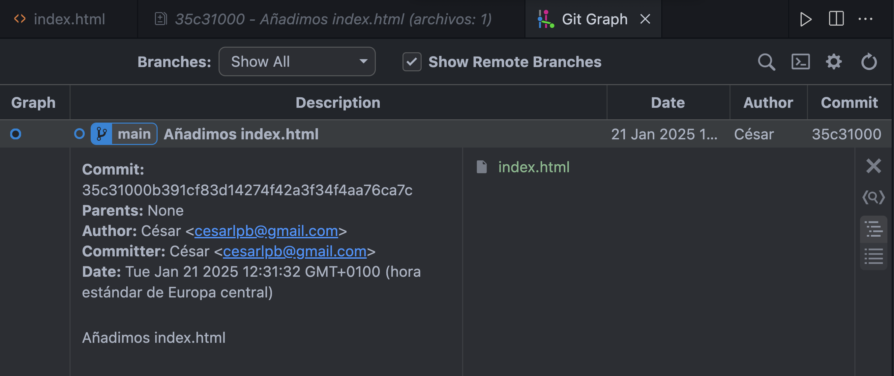

1. Crear un repositorio local o usar uno existente

Creamos un repositorio `01` para resolver este ejercicio:

2. Creamos un cambio > editar algún archivo o crear uno nuevo
  - `index.html`
  - etc.
3. Creamos el commit (interfaz de VS Code) y confirmamos

Añadimos un archivo `index.html` y creamos un commit:

4. Visualizar cambios con `git log` o con control de de cambios de VS Code

5. Hacemos una captura para ver el resultado

`git log`

Usando Visual Code:

<!-- Extensión Git Graph: mhutchie.git-graph -->

Usando la extensión `Git Graph`:

