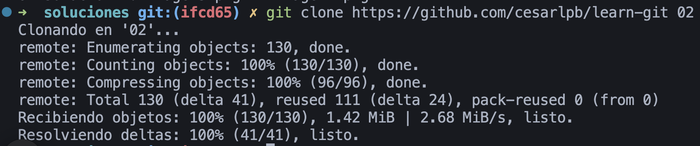
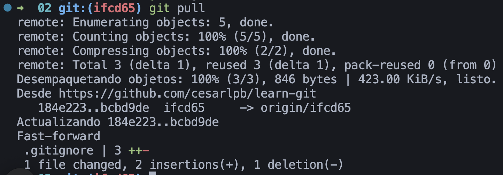
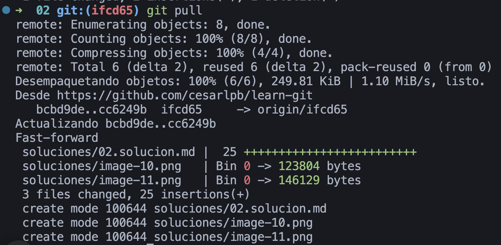

1. Clonar mi repositorio:

```
git clone https://github.com/cesarlpb/learn-git
```

Clonamos en carpeta `02`:

```bash
  git clone https://github.com/cesarlpb/learn-git 02
```



2. Después de que yo suba un un cambio al repositorio, desde dentro de la carpeta anterior:

`git pull`

**Nota:** si no hay cambios nuevos, saldrá "Ya está actualizado".

3. Visualizad los nuevos cambios (si hay alguno)

4. Hacemos captura del resultado

Este es un cambio de ejemplo, se puede hacer otro.

Después de cambiar el `.gitignore` ejecutamos `git pull`:



Después de subir solución del ej 02:


