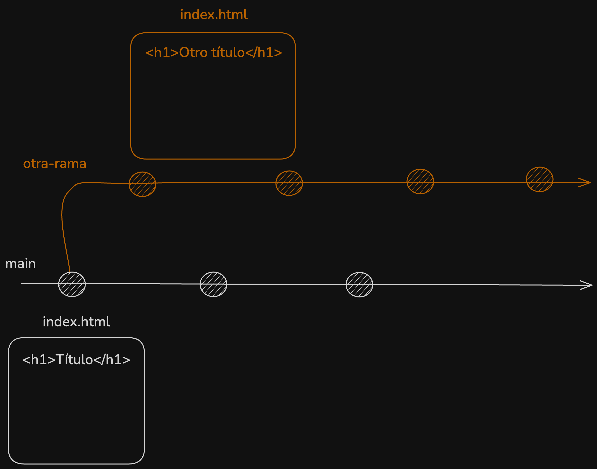
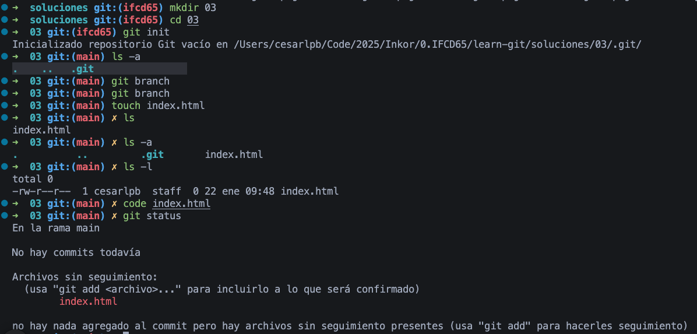
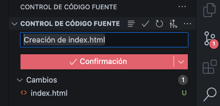
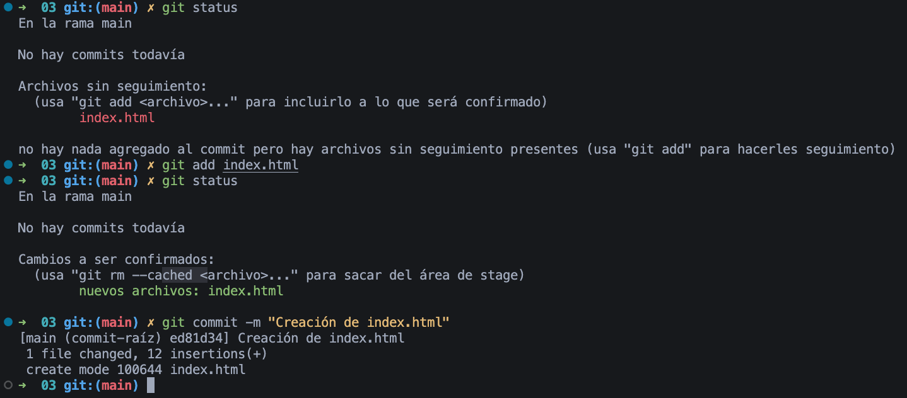
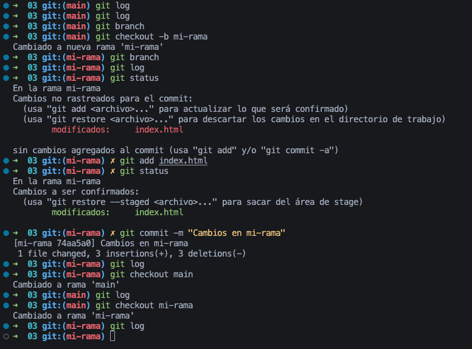
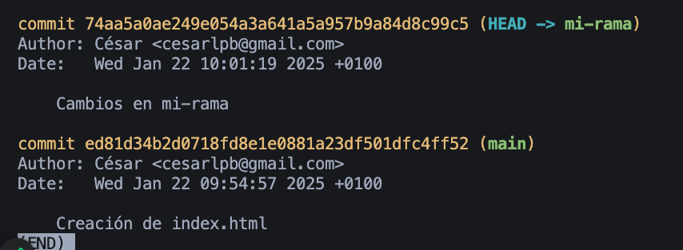
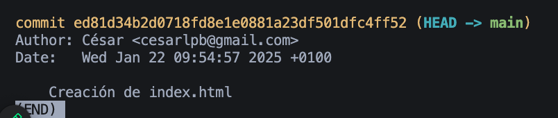

# Ejercicio 03

Diagrama de la solución:



1. Creamos un archivo cualquiera, por ejemplo, `index.html` y hacemos un commit



Hacemos el commit:

- Usando VS Code + click en Confirmación:



- Desde terminal:



Comandos:

```bash
  code .
  git status
  git add index.html
  git status
  git commit -m "Creación de index.html"
```

2. Creamos otra rama, por ejemplo `mi-rama`

Creamos otra rama:



3. Hacemos un cambio diferente

4. Comprobamos que los historiales difieren con `git log` y `git checkout`

5. Hacemos una captura del resultado
Hay 2 commits en `mi-rama`:



Hay solo 1 commit en `main`:



Comandos:

```bash
  git branch
  git checkout -b mi-rama
  git branch
  git log
  git status
  git add index.html
  git status
  git commit -m "Cambios en mi-rama"
  git log
  git checkout main
  git log
  git checkout mi-rama
  git log
  git checkout main
  git log
```
