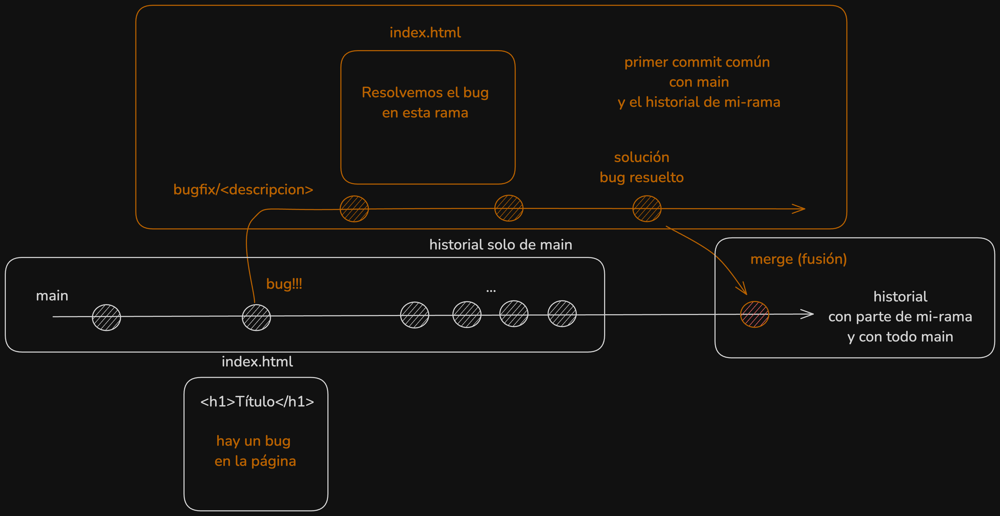
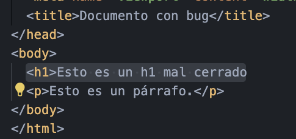
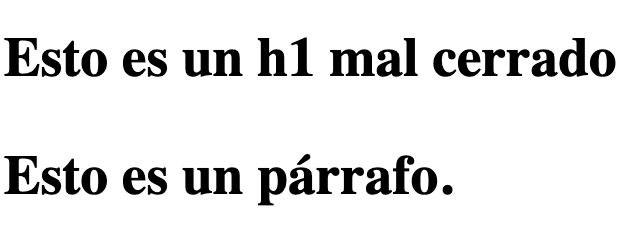
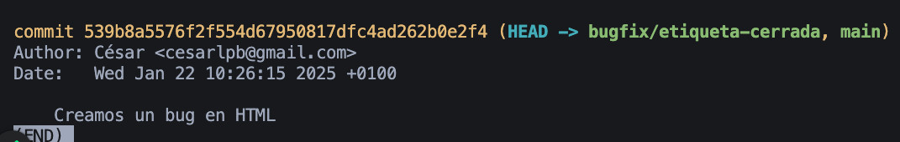
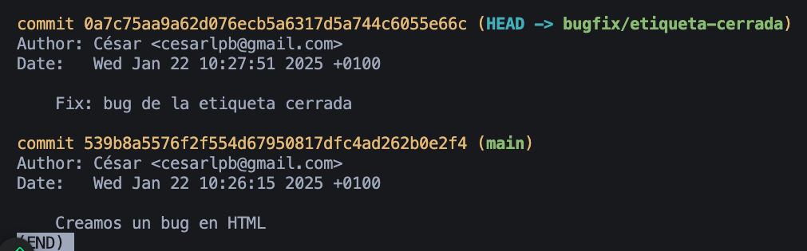
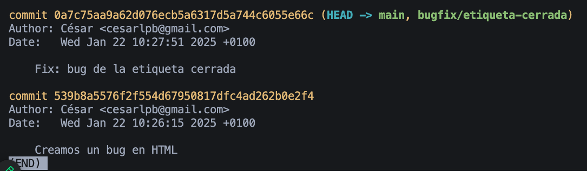
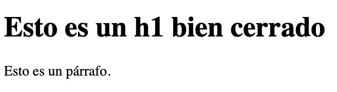
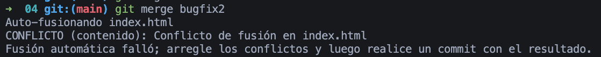
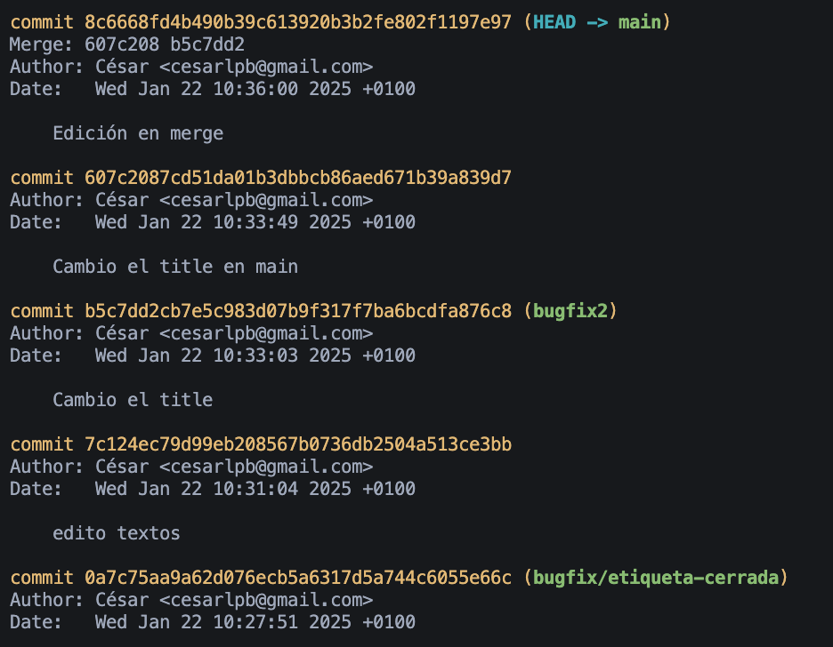
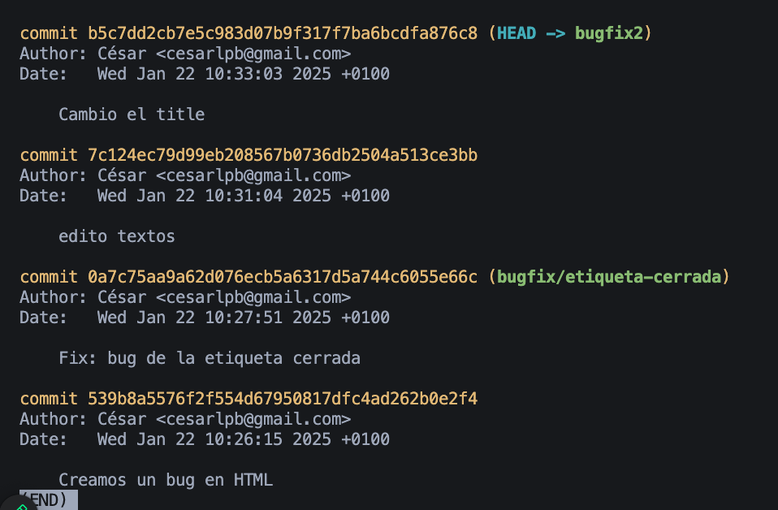

# Ejercicio 04: bugfix

1. Crea un archivo `index.html` con un error deliberado, por ejemplo, una etiqueta mal cerrada.

No cerramos deliberadamente el `<h1>`:

Resultado en navegador:

2. Crea una rama llamada `bugfix/etiqueta-cerrada`.

3. Corrige el error en la rama y haz un commit con el mensaje "Fix: bug de la etiqueta cerrada"

4. Cambia de nuevo a la rama `main`, combina los cambios desde `bugfix/etiqueta-cerrada` con `git merge`.

5. Comprobar que el historial muestra el commit del bugfix con git log. Hacer una captura de pantalla con el resultado.

## Conflicto de Merge

Creamos un conflicto con una rama de ejemplo `bugfix2`:

Si se sigue trabajando en `main`, al hacer merge puede haber conflicto:

Historial final en `main` con un commit adicional para hacer fusión desde `bugfix2` que resuelve el conflicto:

Historial en `bugfix2`:

