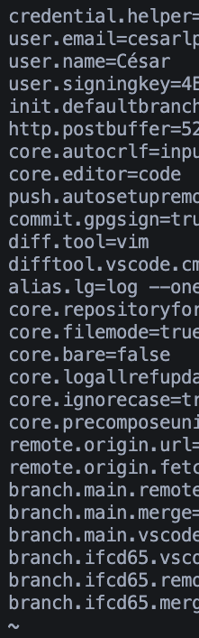

# Ejercicio 05

1. Revisa la configuración actual con `git config --list`.


2. Cambia el nombre y el correo global usando `git config --global`.

- Usuario y email:

```bash
  # Imprescindibles para trabajar con Git:
  git config --global user.name "Tu nombre aquí"  # (no tiene que coincidir con Github)
  git config --global user.email "tu-email-de-Github@aqui.com"  # (recomendable que coincida con el de la cuenta Github)
```

Revisamos valores de `user.name` y `user.email`:

```bash
  git config user.name
  git config user.email
```

Además, cambiamos algunas configuraciones recomendables:

- Editor predeterminado VS Code:

```bash
  git config --global core.editor "code --wait"
```

Comprobamos editor:

```bash
  git config core.editor
```

- (opcional) Herramienta de Comparación:

```bash
  git config --global diff.tool vscode
  git config --global difftool.vscode.cmd "code --wait --diff $LOCAL $REMOTE"
```

Por defecto está en Vim. Pendiente investigar por qué no me abre VS Code en Mac.

- (opcional) Herramienta de Combinación:

```bash
  git config --global merge.tool vscode
  git config --global mergetool.vscode.cmd "code --wait $MERGED"
```

En mi caso, me sale vacío y la herramienta de resolución de conflictos se abre en VS Code.

- ((opcional)) Alias

```bash
  git config --global alias.lg "log --oneline --graph --all --decorate"
```

Configura el comando `git lg` que hace el comando más largo "log..."

Comprobamos el alias con:

```bash
  git config alias.lg 
```

- Caracter de salto de línea:

Windows:

```bash
  git config --global core.autocrlf true
```

Mac o Linux:

```bash
  git config --global core.autocrlf input
```

  - Más información sobre saltos de línea: https://stackoverflow.com/questions/1552749/difference-between-cr-lf-lf-and-cr-line-break-types
  - Aún más información: https://www.aleksandrhovhannisyan.com/blog/crlf-vs-lf-normalizing-line-endings-in-git/


- Colores en comandos:

```bash
  git config --global color.ui auto
```

  Yo lo tengo en blanco, por defecto `git status` y otros comandos imprimen con algunos colores.

  - Configuración de colores por comandos: https://stackoverflow.com/questions/10998792/how-to-color-the-git-console


- (se puede dejar en 1MB) Subida de datos por HTTP:

```bash
  git config --global http.postBuffer 524288000 # 500 MB
```

- (muy opcional) Configuración de Threads para clonar:

```bash
  git config --global pack.threads 4
```

Yo lo tengo en blanco.


- Verificar commits en fetch:

```bash
  git config --global fetch.fsckObjects true
```

Yo lo tengo en blanco.

## Seguridad

Por lo general, solo guardamos contraseñas en nuestros ordenadores personales y NO en ordenadores públicos. Además, hay que evitar que se almacenen en texto plano:

```bash
  git config --global credential.helper cache
```

Mac:

```bash
  git config --global credential.helper osxkeychain
```

Windows:

```bash
  # Antes de Git 2.39+
  git config --global credential.helper manager-core

  # Después Git 2.39+
  git config --global credential.helper manager
```

  - Más información: https://stackoverflow.com/questions/46878457/adding-git-credentials-on-windows

## Guardado/Edición de Configuración

```bash
  git config --list > git-config.txt
```

En Windows: copiar la salida `git config --list` a un archivo.

```bash
  git config --global --edit # Si no abre VS Code, revisad git config core.editor
```

3. Crea un repositorio nuevo y comprueba que el commit lleva la configuración actualizada.



4. Si es necesario, cambia temporalmente la configuración local solo para ese repositorio.

Niveles de modificación de configuraciones:

```bash

  --system afecta a todos los usuarios y repositorios
  --global afecta a todos los repositorios de mi usuario
  --local  afecta solo al repositorio actual
  --file   solo para el archivo indicado en el comando

```

5. Haz un commit con la configuración modificada y verifica los detalles con `git log`.


