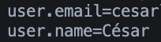

# Ejercicio 05

1. Revisa la configuración actual con `git config --list`.



2. Cambia el nombre y el correo global usando `git config --global`.

```bash
  git config --global user.name "Tu nombre aquí"  # (no tiene que coincidir con Github)
  git config --global user.email "tu-email-de-Github@aqui.com"  # (recomendable que coincida con el de la cuenta Github)
```

3. Crea un repositorio nuevo y comprueba que el commit lleva la configuración actualizada.

4. Si es necesario, cambia temporalmente la configuración local solo para ese repositorio.

5. Haz un commit con la configuración modificada y verifica los detalles con `git log`.
